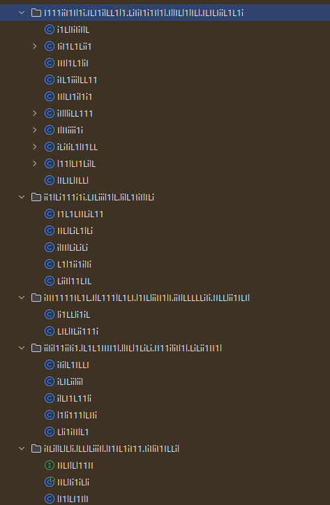
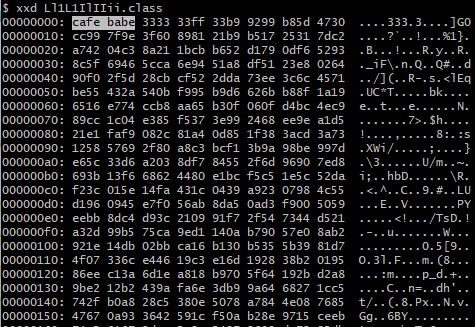

# Jar-Obfuscator

[CHANGE LOG](CHANGELOG.MD)


**该项目刚开始开发，可能存在较多的BUG，欢迎测试和提出问题**

`Jar Obfuscator` 是一个 `JAR/CLASS` 文件混淆工具

- 命令行模式，简单易用
- 仅单个 `JAR` 文件小于 `1 MB` 超轻量
- 简洁的配置文件快速上手
- 输入 `JAR` 直接输出混淆后的 `JAR`


## 开始

[前往下载](https://github.com/jar-analyzer/jar-obfuscator/releases/latest)

简单命令即可启动（第一次启动将自动生成配置文件）

```shell
java -jar jar-obfuscator.jar --jar test.jar --config config.yaml
```


支持的混淆内容

- 类名混淆（包含引用修改）
- 包名混淆（包含引用修改）
- 方法名混淆（包含引用修改）
- 字段名混淆（包含引用修改）
- 方法内参数名混淆（包含引用修改）
- 删除编译调试信息（删除行号信息）
- 字符串加密运行时解密（使用 `AES` 加密）
- 字符串提取数组混淆（访问数组方式得到字符串）
- 整型常数异或混淆（多重异或的加密）
- 垃圾代码花指令混淆（可指定多级别的混淆）
- 使用某些技巧可以在反编译时隐藏方法
- 使用某些技巧可以在反编译时隐藏字段
- 基于 `JVMTI` 的字节码加密（beta）

其中 `包含引用修改` 的功能可能因为修改引用导致程序出问题

## 配置

类名/包名/方法名/字段名的混淆需要分析整体项目的依赖引用
- 类名混淆 `enableClassName`
- 包名混淆 `enablePackageName`
- 方法混淆 `enableMethodName`
- 字段混淆 `enableFieldName`

由于需要修改引用，可能出现预期外的情况

以下混淆不修改引用，相对稳定靠谱，如遇报错可以搭配使用以下配置
- 开启 `enableEncryptString` 和 `enableAdvanceString` 加密字符串
- 开启 `enableJunk` 花指令混淆
- 开启 `enableXOR` 对数字进行异或加密

注意：如果 `obfuscatePackage` 和 `rootPackages` 都不配置，其他的配置不会生效（系统不知道需要对哪些类混淆）

**一个新手上手应该做的是**
- `mainClass` 填写你的主类名
- `obfuscatePackage` 填写你需要混淆的包名（必须）
- `rootPackages` 填写你项目的根包（分析和修改引用的范围 必须）
- 其他可选配置**按需配置**即可
- 如果要开启 `enableMethodName` 需要自行调参黑名单

```yaml
# jar obfuscator 配置文件
# jar obfuscator by jar-analyzer team (4ra1n)
# https://github.com/jar-analyzer/jar-obfuscator

# 日志级别
# debug info warn error
logLevel: info

# 主类名
# 不设置主类名可能无法正常执行主函数
# 1. 遇到主类名会记录混淆后的新主类名
# 2. 替换 MANIFEST.MF 中的主类名
# 这样的操作可以使 java -jar 仍然可以正常启动
mainClass: me.n1ar4.jar.obfuscator.Main
# 自动修改 META-INF 的主类配置
# 除非你的项目不含主类只是纯库函数
modifyManifest: true

# 混淆字符配置
# 类名方法名等信息会根据字符进行随机排列组合
obfuscateChars: [ i, l, L, '1', I ]
# 混淆包名称 必须配置否则无法运行
# 建议仅设置关键部分不要设置范围过大
# 不需要通配符 只写 a.b.c 包名即可
# 如果配置 a.b 会混淆 a.b.X 和 a.b.c.X 等以此类推
obfuscatePackage: [ me.n1ar4, org.n1ar4 ]
# 需要混淆的根包名
# 避免处理 org.apache 等无关 class
# 这个配置主要的意义是分析引用关系时仅考虑该配置下的
rootPackages: [ me.n1ar4, org.n1ar4 ]
# 不对某些类做混淆（不混淆其中的所有内容）
# 例如反射调用/JAVAFX FXML绑定等情况
classBlackList: [ javafx.controller.DemoController ]
# 不对某些 method 名做混淆 正则
# visit.* 忽略 JAVA ASM 的 visitCode visitMethod 等方法
# start.* 忽略 JAVAFX 因为启动基于 start 方法
# 以此类推某些方法和类是不能混淆的（类继承和接口实现等）
methodBlackList: [ visit.*, start.* ]

# 开启类名混淆
enableClassName: true
# 开启包名混淆（仅混淆 obfuscatePackage 配置）
enablePackageName: true
# 开启方法名混淆 - 不稳定
enableMethodName: false
# 开启字段混淆
enableFieldName: true
# 开启参数名混淆
enableParamName: true

# 开启加密字符串
enableEncryptString: true
# 加密使用 AES KEY
# 注意长度必须是 16 且不包含中文
stringAesKey: Y4SuperSecretKey
# 开启进阶字符串混淆
enableAdvanceString: true
# 进阶字符串处理参数
advanceStringName: GIiIiLA
# 字符串解密类名
decryptClassName: org.apache.commons.collections.list.AbstractHashMap
# 字符串解密方法名
decryptMethodName: newMap
# 字符串 AES KEY 名字
decryptKeyName: LiLiLLLiiiLLiiLLi

# 是否隐藏方法
# 给混淆方法添加 ACC_SYNTHETIC 可以在反编译时隐藏
# 参考 Y4tacker 的 HackingFernFlower
# 仅在混淆方法开启时生效
enableHideMethod: true
# 是否隐藏字段
# 给字段添加 ACC_SYNTHETIC 可以在反编译时隐藏
# 参考 Y4tacker 的 HackingFernFlower
# 仅在混淆字段开启时生效
enableHideField: true

# 开启删除编译信息选项
enableDeleteCompileInfo: true
# 开启数字异或混淆
enableXOR: true

# 开启花指令混淆
enableJunk: true
# 花指令级别
# 最低1 最高5
junkLevel: 5
# 一个类中的花指令数量上限
maxJunkOneClass: 2000

# 是否打印所有主函数
showAllMainMethods: true

# 是否开启进阶 JVMTI 加密字节码
# 注意仅支持 WINDOWS 和 LINUX 且不一定稳定
enableSuperObfuscate: false
# 加密 KEY 配置
# 注意长度必须是 16 位
superObfuscateKey: 4ra1n4ra1n4ra1n1
# 加密包名配置
superObfuscatePackage: me.n1ar4

# 是否保留临时类文件
keepTempFile: false
```

## 实战

**示例一** 

我有一个 `JAVAFX` 项目
- 主类是 `com.n1ar4.gui.Main` 
- 使用的 `fxml` 绑定的是 `com.n1ar4.controller.DemoController`

由于 `fxml` 中的绑定类和方法无法修改，所以 `controller` 类暂不能混淆

```xml
<AnchorPane fx:controller="com.n1ar4.controller.DemoController"/>
```

如果我想完全混淆，应该给出这样的配置

```yaml
# 混淆包名称
obfuscatePackage: [ com.n1ar4 ]
# 混淆根包名
rootPackages: [ com.n1ar4 ]
# 不要混淆 fxml 绑定的 controller
classBlackList: [ com.n1ar4.controller.DemoController ]
# 注意 javafx 的启动类 start 方法不能改名
methodBlackList: [ start.* ]
```

如果只混淆核心包 `com.n1ar4.core` 这样配置

```yaml
# 混淆包名称
obfuscatePackage: [ com.n1ar4.core ]
# 混淆根包名
rootPackages: [ com.n1ar4 ]
# 不要混淆 fxml 绑定的 controller
classBlackList: [ com.n1ar4.controller.DemoController ]
# 这时候不用特殊处理 javafx 启动类的问题了
methodBlackList: [ ]
```

以上根包名的配置意义：只分析根包名下的类之间的引用关系

**示例二**

我项目使用了 `Apache Log4j2` 等组件如果我混淆类名和方法名，会报错无法启动

于是我使用不修改引用的混淆手段

```yaml
enableEncryptString: true
stringAesKey: Y4SuperSecretKey # 注意必须16位的KEY
enableAdvanceString: true
advanceStringName: GIiIiLA # 随意取名

enableDeleteCompileInfo: true
enableXOR: true

enableJunk: true
junkLevel: 5
maxJunkOneClass: 2000 # 防止混淆太大超出方法最大限制
```

如果你想体验进一步更强的加密混淆，可以开启超级配置

```yaml
enableSuperObfuscate: true
superObfuscateKey: 4ra1n4ra1n4ra1n1 # 注意必须16位的KEY
superObfuscatePackage: me.n1ar4 # 需要 JVMTI 加密的包名
```

启动 `JAR` 时使用以下的参数即可

```shell
java -agentpath:/path/to/libdecrypter.dll=PACKAGE_NAME=me.n1ar4,KEY=4ra1n4ra1n4ra1n1 -jar test.jar
```

该命令将会在 `JVM` 启动时使用 `libdecrypter.dll` 库解密（该库文件会自动导出）

你可以自行修改 `native` 目录的 `C/ASM` 代码自定义加密解密，是程序更安全

**示例三**

我混淆出来的为什么报错打不开

解决：
- 控制变量逐个尝试和搭配，逐个参数测试是否正常运行
- 关闭 `enableMethodName` 配置后再测试
- 注意 `rootPackages` 和 `obfuscatePackage` 配置
- 如果以上方案都不行，最终请使用**不修改引用**的几个配置（参考上文）

## 效果

测试类

```java
package com.test;

public class Hello {
    private static void add(int a, int b) {
        int c = a + b;
        System.out.println("a + b = " + c);
    }

    public static void main(String[] args) {
        add(1, 2);
    }
}
```

混淆后 `main` 方法部分指令 (全部指令过长不便显示)

```java
public static main([Ljava/lang/String;)V
    LDC 50917067
    LDC 133762565
    ICONST_0
    ICONST_1
    IADD
    POP
    IXOR
    LDC 83446414
    LDC 567873
    ICONST_0
    ICONST_1
    IADD
    POP
    IXOR
    ICONST_0
    ICONST_1
    IADD
    // ...
    POP
    POP
    POP
    INVOKESTATIC com/test/Ll1L1IlIIii.lLil1Ll11l1 (II)V
    // ...
```

混淆后 `main` 方法代码

```java
public static void main(String[] lLiIIiIiLlI) {
    int var10002 = 0 + 1;
    int var10000 = 50917067 ^ 133762565;
    int var10003 = 0 + 1;
    int var10001 = 83446414 ^ 567873;
    var10002 = 0 + 1;
    var10000 ^= var10001;
    var10003 = 0 + 1;
    var10001 = 44140772 ^ 109412867;
    int var10004 = 0 + 1;
    var10002 = 25080190 ^ 89832347;
    var10003 = 0 + 1;
    var10001 ^= var10002;
    int var10005 = 54 + 5 - 3;
    byte var1 = 54;
    lLil1Ll11l1(var10000, var10001);
    var10000 = 0 + 1;
}
```

对于字符串 `"a + b = "` 的混淆

```java
// ...
private static ArrayList<String> GIiIiLA;
// ...
// 全局数组提取
String var5 = (String)GIiIiLA.get(var10003);
var10006 = 74 + 5 - 3;
byte var6 = 74;
// AES解密
var5 = i1LL1iLiLI.I(var5);
var10006 = 9 + 5 - 3;
var6 = 9;
// 字符串拼接
var10001 = var10001.append(var5);
//...
static {
    int var10001 = 0 + 1;
    int var10005 = 57 + 5 - 3;
    byte var10004 = 57;
    GIiIiLA = new ArrayList();
    var10005 = 99 + 5 - 3;
    var10004 = 99;
    // 全局数组初始化
    GIiIiLA.add("ahKHK3TcdrEge+jLkE23xg==");
    var10001 = 0 + 1;
    int var10000 = 0 + 1;
}
```

包名类名的混淆效果



通过定义配置文件的 `obfuscateChars` 可以做更有趣的混淆


## 进阶

开启 `JVMTI` 加密的混淆效果

（该类是非法字节码无法直接运行也无法反编译）



如果开启该选项，比如启动时指定特殊本地库进行解密

使用 `JNI` 加密字节码，通过 `JVMTI` 解密字节码以保护代码

提供两份 `DLL/SO` 文件，一份加密一份解密，实际运行只需使用解密 `DLL/SO` 文件，支持自定义密钥和包名

```shell
java -XX:+DisableAttachMechanism -agentpath:decrypter.dll=PACKAGE_NAME=com.your.pack,KEY=your-key -jar your-jar.jar
```

注意：加密后的 `JAR` 第一次可能无法运行，第二次可以正常运行

加密后的 `CLASS` 文件变成无法解析的畸形文件


除了开头保持了 `MAGIC` 部分，后续是无法解析的字节


使用指定参数启动即可禁止 `Java Agent` 动态 `dump` 字节码


对于更资深的黑客，他们会想到 `sa-jdi` 的 `HSDB` 来 `dump` 字节码

我参考 `Beichen` 师傅议题的思路，从 `JVM` 里禁用了 `gHotSpotVMStructs` 函数

支持 `Windows` 系统


支持 `Linux` 系统


注意：可能不适用于启动扫描 `class` 的项目（典型的项目比如 `SpringBoot` 等）

## BUILD

Base:

- Windows: JDK 8 + Maven
- Linux: JDK 8 + Maven

JVMTI: 

- Windows: MSVC + ml64 + CMake 3.x
- Linux: gcc + nasm + CMake 3.x
- Optional: Python 3.x

