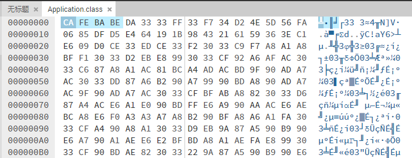
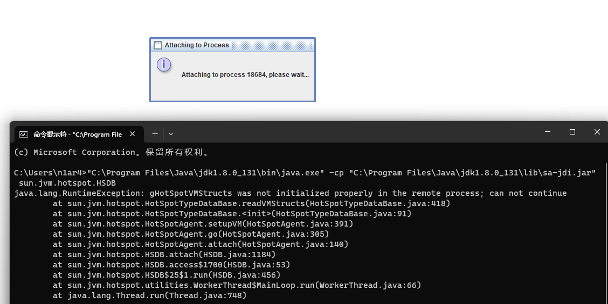

# Jar-Obfuscator

[CHANGE LOG](CHANGELOG.MD)


`Jar-Obfuscator` 是一个 `JAR/CLASS` 文件混淆工具

- 命令行模式，简单易用
- 仅单个 `JAR` 文件小于 `1 MB` 超轻量
- 简洁的配置文件快速上手
- 输入 `JAR` 直接输出混淆后的 `JAR`


## 开始

[前往下载](https://github.com/jar-analyzer/jar-obfuscator/releases/latest)

简单命令即可启动（第一次启动将自动生成配置文件）

```shell
java -jar jar-obfuscator.jar --jar test.jar --config config.yaml
```

支持的混淆内容

- 类名混淆（包含引用修改）
- 包名混淆（包含引用修改）
- 方法名混淆（包含引用修改）
- 字段名混淆（包含引用修改）
- 方法内参数名混淆（包含引用修改）
- 删除编译调试信息（删除行号信息）
- 字符串加密运行时解密（使用 `AES` 加密）
- 字符串提取数组混淆（访问数组方式得到字符串）
- 整型常数异或混淆（多重异或的加密）
- 垃圾代码花指令混淆（可指定多级别的混淆）
- 基于 `JVMTI` 的字节码加密（beta）

## 配置

**一般而言用户不需要动这里的参数**

- 如果是通过 `java -jar` 启动的 `jar` 配置 `mainClass` 即可
- 如果需要开启 `JVMTI` 字节码加密功能配置 `enableSuperObfuscate` 即可
- 如果混淆遇到 `BUG` 尝试调整 `methodBlackList` 和 `obfuscatePackage` 配置

```yaml
# jar obfuscator 配置文件
# jar obfuscator by jar-analyzer team (4ra1n)
# https://github.com/jar-analyzer/jar-obfuscator

# 日志级别
# debug info warn error
logLevel: info

# 主类名
# 不设置主类名可能无法正常执行主函数
mainClass: me.n1ar4.jar.obfuscator.Main
# 自动修改 META-INF 的主类配置
modifyManifest: true

# 混淆字符配置
obfuscateChars: [ i, l, L, '1', I ]
# 混淆包名称 必须配置否则无法运行
# 建议仅设置关键部分不要设置范围过大
obfuscatePackage: [ me.n1ar4, org.n1ar4 ]
# 不对某些 method 名做混淆
methodBlackList: [ visit.* ]

# 开启类名混淆
enableClassName: true
# 开启包名混淆（仅混淆 obfuscatePackage 配置）
enablePackageName: true
# 开启方法名混淆
enableMethodName: true
# 开启字段混淆
enableFieldName: true
# 开启参数名混淆
enableParamName: true

# 开启加密字符串
enableEncryptString: true
# 开启进阶字符串混淆
enableAdvanceString: true
# 进阶字符串处理参数
advanceStringName: GIiIiLA

# 开启删除编译信息选项
enableDeleteCompileInfo: true
# 开启数字异或混淆
enableXOR: true

# 开启花指令混淆
enableJunk: true
# 花指令级别
# 最低1 最高3
junkLevel: 3
# 一个类中的花指令数量上限
maxJunkOneClass: 2000

# 是否打印所有主函数
showAllMainMethods: true

# 是否开启进阶 JVMTI 加密字节码
enableSuperObfuscate: false
# 加密 KEY 配置
# 注意长度必须是 16 位
superObfuscateKey: 4ra1n4ra1n4ra1n1
# 加密包名配置
superObfuscatePackage: me.n1ar4
```

## 效果

测试类

```java
package com.test;

public class Hello {
    private static void add(int a, int b) {
        int c = a + b;
        System.out.println("a + b = " + c);
    }

    public static void main(String[] args) {
        add(1, 2);
    }
}
```

混淆后 `main` 方法部分指令 (全部指令过长不便显示)

```java
public static main([Ljava/lang/String;)V
    LDC 50917067
    LDC 133762565
    ICONST_0
    ICONST_1
    IADD
    POP
    IXOR
    LDC 83446414
    LDC 567873
    ICONST_0
    ICONST_1
    IADD
    POP
    IXOR
    ICONST_0
    ICONST_1
    IADD
    // ...
    POP
    POP
    POP
    INVOKESTATIC com/test/Ll1L1IlIIii.lLil1Ll11l1 (II)V
    // ...
```

混淆后 `main` 方法代码

```java
public static void main(String[] lLiIIiIiLlI) {
    int var10002 = 0 + 1;
    int var10000 = 50917067 ^ 133762565;
    int var10003 = 0 + 1;
    int var10001 = 83446414 ^ 567873;
    var10002 = 0 + 1;
    var10000 ^= var10001;
    var10003 = 0 + 1;
    var10001 = 44140772 ^ 109412867;
    int var10004 = 0 + 1;
    var10002 = 25080190 ^ 89832347;
    var10003 = 0 + 1;
    var10001 ^= var10002;
    int var10005 = 54 + 5 - 3;
    byte var1 = 54;
    lLil1Ll11l1(var10000, var10001);
    var10000 = 0 + 1;
}
```

对于字符串 `"a + b = "` 的混淆

```java
// ...
private static ArrayList<String> GIiIiLA;
// ...
// 全局数组提取
String var5 = (String)GIiIiLA.get(var10003);
var10006 = 74 + 5 - 3;
byte var6 = 74;
// AES解密
var5 = i1LL1iLiLI.I(var5);
var10006 = 9 + 5 - 3;
var6 = 9;
// 字符串拼接
var10001 = var10001.append(var5);
//...
static {
    int var10001 = 0 + 1;
    int var10005 = 57 + 5 - 3;
    byte var10004 = 57;
    GIiIiLA = new ArrayList();
    var10005 = 99 + 5 - 3;
    var10004 = 99;
    // 全局数组初始化
    GIiIiLA.add("ahKHK3TcdrEge+jLkE23xg==");
    var10001 = 0 + 1;
    int var10000 = 0 + 1;
}
```

包名类名的混淆效果


通过定义配置文件的 `obfuscateChars` 可以做更有趣的混淆


## 进阶

开启 `JVMTI` 加密的混淆效果

（该类是非法字节码无法直接运行也无法反编译）


如果开启该选项，比如启动时指定特殊本地库进行解密

使用 `JNI` 加密字节码，通过 `JVMTI` 解密字节码以保护代码

提供两份 `DLL/SO` 文件，一份加密一份解密，实际运行只需使用解密 `DLL/SO` 文件，支持自定义密钥和包名

```shell
java -XX:+DisableAttachMechanism -agentpath:decrypter.dll=PACKAGE_NAME=com.your.pack,KEY=your-key --jar your-jar.jar
```

加密后的 `CLASS` 文件变成无法解析的畸形文件


除了开头保持了 `MAGIC` 部分，后续是无法解析的字节



使用指定参数启动即可禁止 `Java Agent` 动态 `dump` 字节码


对于更资深的黑客，他们会想到 `sa-jdi` 的 `HSDB` 来 `dump` 字节码

我参考 `Beichen` 师傅议题的思路，从 `JVM` 里禁用了 `gHotSpotVMStructs` 函数

支持 `Windows` 系统



支持 `Linux` 系统


注意：可能不适用于启动扫描 `class` 的项目（典型的项目比如 `SpringBoot` 等）

## BUILD

Base:

- Windows: JDK 8 + Maven
- Linux: JDK 8 + Maven

JVMTI: 

- Windows: MSVC + ml64 + CMake 3.x
- Linux: gcc + nasm + CMake 3.x
- Optional: Python 3.x

